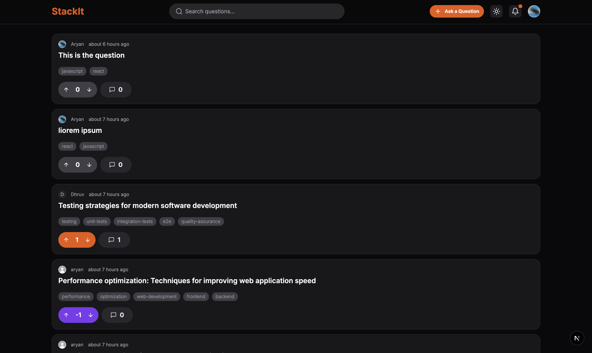
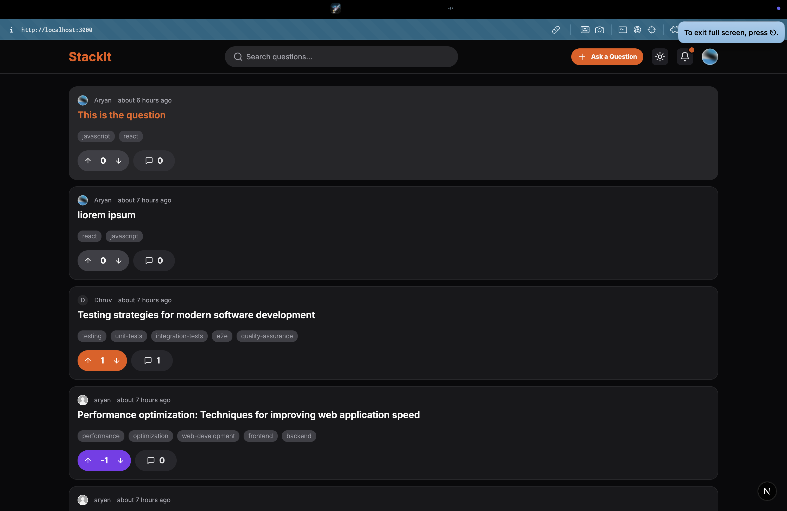
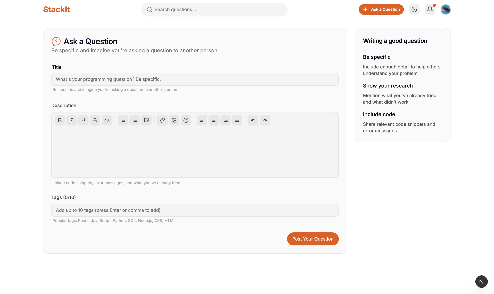
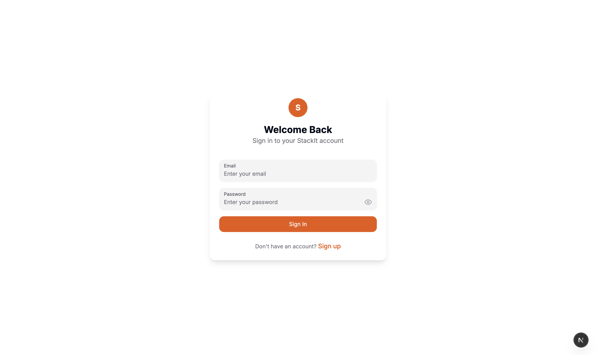
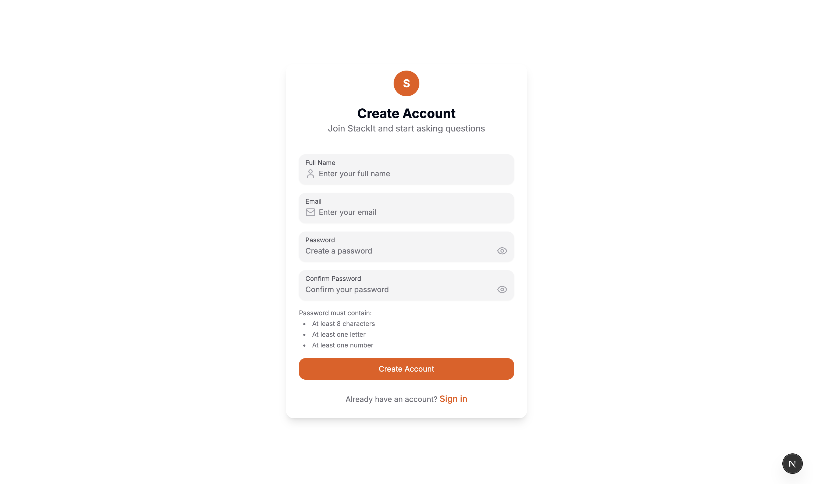
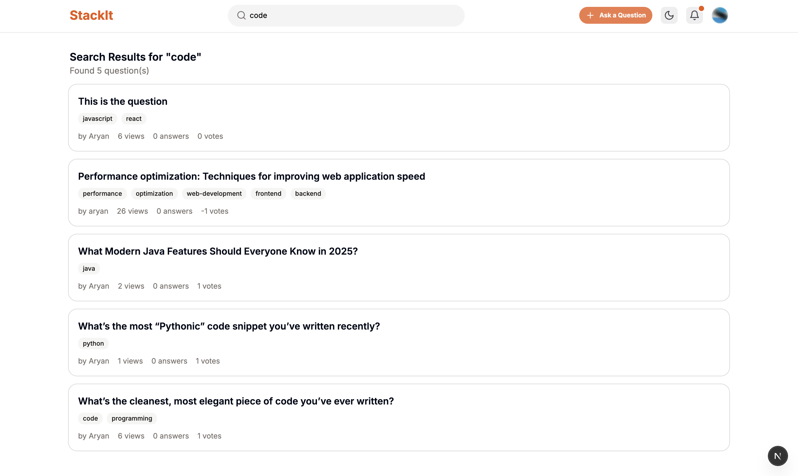
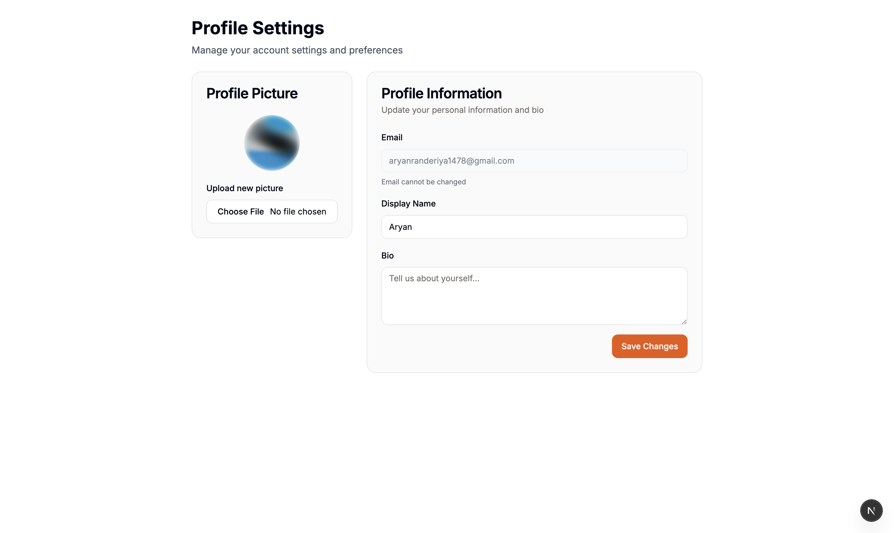

# 🧠 StackIt – Minimal Q&A Platform

**StackIt** is a lightweight question-and-answer platform designed for collaborative learning and structured knowledge sharing.

---

## 📸 Screenshots

### Homepage
 

### Core Features
 

### User Experience
   

---

## ✨ Features

### 🔐 Authentication & User Management
- **JWT Authentication** with refresh tokens
- **Role-based access** (Guest, User, Admin)
- **User registration** with validation
- **Profile management** with avatar upload
- **Password reset** functionality

### 📝 Q&A System
- **Rich text editor** with full formatting (bold, italic, lists, emojis, images)
- **Ask questions** with titles, descriptions, and tags
- **Answer questions** with formatted responses
- **Vote system** (upvote/downvote) for questions and answers
- **Accept answers** functionality for question owners

### 🏷️ Organization & Discovery
- **Tagging system** with multi-select input
- **Advanced search** with semantic search (ChromaDB)
- **Real-time search** with debouncing
- **Filter by tags** and categories
- **Sort options** (newest, most voted, most viewed)
- **Pagination** for large result sets

### 🔔 Notifications
- **Real-time notifications** with bell icon
- **Unread count** display
- **Dropdown menu** with recent notifications
- **Mark as read** functionality
- **Notifications for**: new answers, comments, mentions

### 👨‍💼 Admin Dashboard
- **User management** (view, edit, suspend users)
- **Content moderation** (flag inappropriate content)
- **Analytics dashboard** with platform statistics
- **System configuration** and settings
- **Bulk operations** for mass management

### 🎨 UI/UX Features
- **Responsive design** (mobile-first approach)
- **Dark/Light theme** with proper color contrast
- **Breadcrumb navigation** for clear user location
- **Loading states** with skeleton screens
- **Error handling** with user-friendly messages
- **Accessibility** (WCAG 2.1 AA compliance)

### ⚡ Performance & Security
- **Caching strategy** (Redis for sessions and data)
- **Memory management** with React Query
- **Network optimization** with minimal API calls
- **Bundle optimization** with code splitting
- **Input validation** and sanitization
- **Rate limiting** for API endpoints
- **XSS protection** with content security policies

---

## 🛠️ Tech Stack

| Layer | Technology |
|-------|------------|
| **Backend** | FastAPI, MongoDB, Redis, ChromaDB |
| **Frontend** | Next.js 14, TypeScript, HeroUI, Tailwind CSS |
| **Authentication** | JWT, bcrypt |
| **Search** | ChromaDB (semantic search) |
| **Caching** | Redis |
| **Validation** | Pydantic, React Hook Form, Zod |

---

## 🚀 Quick Start

```bash
# Clone repository
git clone https://github.com/your-username/stackit.git
cd stackit

# Backend setup
cd backend
pip install -r requirements.txt
python seed_admin_users.py
uvicorn app.main:app --reload

# Frontend setup
cd ../frontend
npm install
npm run dev
```

**Access**: Frontend (http://localhost:3000) | Backend (http://localhost:8000) | Admin (http://localhost:3000/admin)

---

## 📊 Performance Metrics

- **Page Load Time**: < 2 seconds
- **Search Response**: < 500ms  
- **Real-time Updates**: < 100ms latency
- **Mobile Performance**: 90+ Lighthouse score

---

## 🔑 Default Admin Credentials

| Email | Password | Role |
|-------|----------|------|
| admin@stackit.com | Admin123! | Admin |
| superadmin@stackit.com | SuperAdmin123! | Admin |
| platform@stackit.com | Platform123! | Admin |

---

## 📄 License

MIT License - see [LICENSE](LICENSE) file for details.

---

**StackIt** - Empowering collaborative learning through structured Q&A discussions! 🚀
